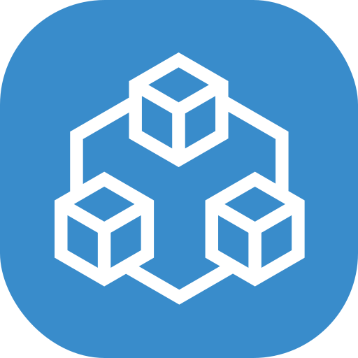
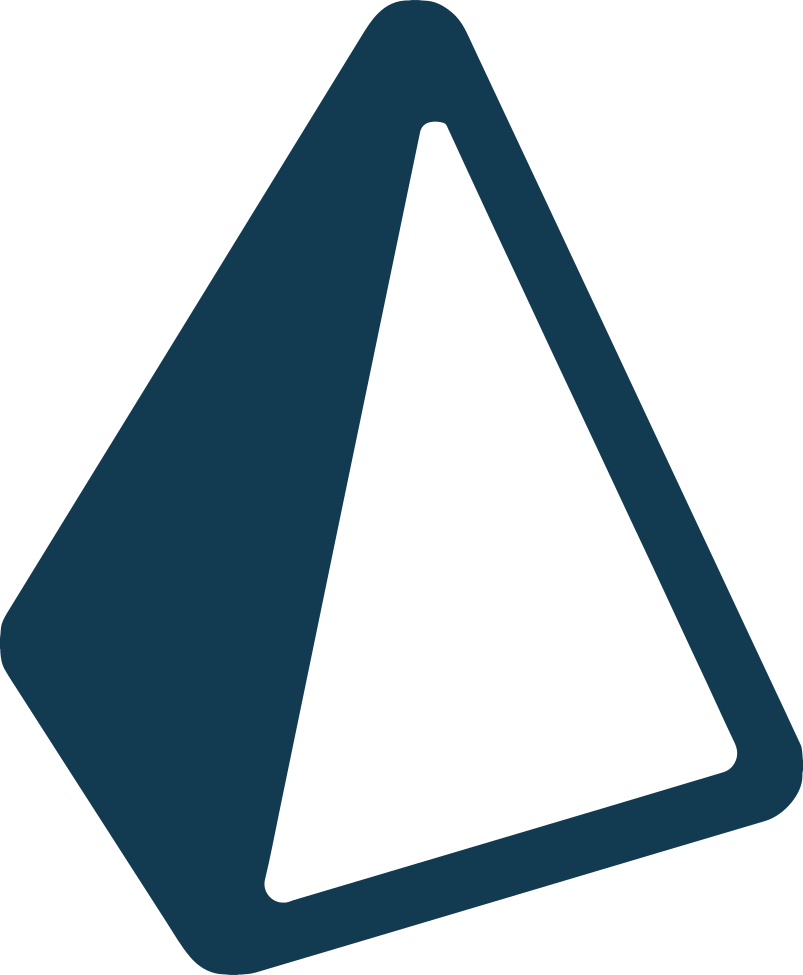

# sq, eskiu, call me whatever you want :)

Mostly webdev, going to learn more low-level languages such as Rust

# 👑 Favorite technologies

# 📚 More libraries

and more!

# 🧪 Backend

and more!

# 🛢 DB-related

and more!

# 🔍 Utils

and more!
